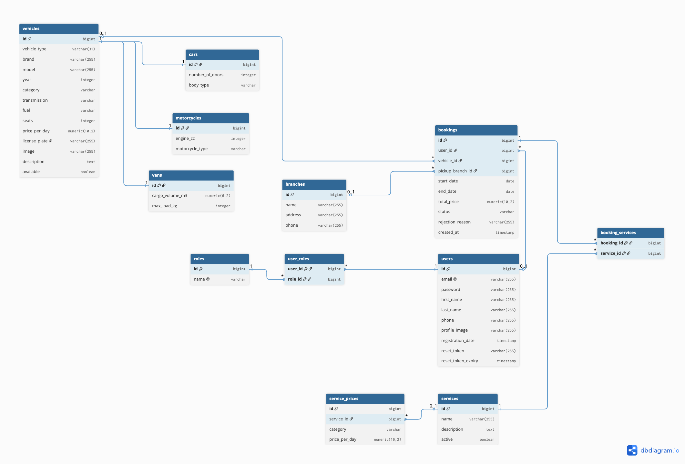

# CarRentalManager - Backend Project

## Panoramica dell'applicazione e funzionalità

CarRentalManager è un'applicazione Backend REST sviluppata con **Spring Boot 3** e **PostgreSQL** per la gestione di un servizio di autonoleggio. Il sistema è costituito da: 
1) catalogo di veicoli (auto, moto e van);
2) utenti con ruoli differenti (ADMIN, EMPLOYEE, CUSTOMER);
3) prenotazioni con relativo ciclo di approvazione (IN ATTESA, APPROVATO, RIFIUTATO, CHIUSO); 
4) servizi accessori opzionali con prezzo per categoria di veicolo;
5) autenticazione tramite JWT;
6) report aggregati per la gestione;
7) integrazione con tre API di terze parti (Cloudinary, Mailgun e ui-avatars).
Tutti i dati vengono salvati in un database relazionale PostgreSQL tramite JPA/Hibernate, garantendo scalabilità, integrità referenziale e accesso concorrente.

Progetto realizzato come prova finale del corso di Backend Programming - EPICODE.

## Copertura dei requisiti

| Requisito | Implementazione |
|-----------|-----------------|
| Almeno 8 tabelle con relazioni significative | 12 tabelle: `roles`, `users`, `user_roles`, `vehicles`, `cars`, `motorcycles`, `vans`, `bookings`, `booking_services`, `branches`, `services`, `service_prices` |
| Struttura di ereditarietà | `Vehicle` (base) con ereditarietà JOINED → `Car`, `Motorcycle`, `Van` |
| Gestione utenti con immagine profilo | Registrazione, login, upload avatar con Cloudinary, avatar automatico con ui-avatars (generazione automatica dell'immagine profilo con iniziali nome e cognome), dati anagrafici e data di registrazione |
| API REST con error handling consistente | Risposte JSON di errore strutturate tramite gestore globale; Bean Validation su tutti i DTO in ingresso |
| Autenticazione JWT + 3 ruoli | ADMIN, CUSTOMER e EMPLOYEE ognuno con permessi distinti definiti in `SecurityConfig` |
| Query con filtri, ordinamento, aggregazioni | Filtri per categoria/carburante, ricerca testuale per marca/modello, ordinamento per prezzo, query JPQL, aggregazioni SUM/COUNT, paginazione |
| Validazione e gestione errori | Bean Validation sui DTO + `GlobalExceptionHandler` con formato `ApiError` |
| Almeno 2 API di terze parti | Tre integrazioni API esterne: Cloudinary (immagini), Mailgun (email), ui-avatars (avatar) |
| Collection Postman | Collection completa nella cartella `postman/` |

## Funzionalità principali

- Registrazione e login degli utenti con autenticazione JWT e tre ruoli distinti (ADMIN, CUSTOMER, EMPLOYEE).
- Recupero password in due fasi: l'utente richiede il reset e riceve via email (tramite servizio Mailgun) un token temporaneo e attraverso quel token imposta una nuova password.
- Gestione del profilo utente, con immagine profilo aggiornabile caricata su Cloudinary e data di registrazione impostata automaticamente.
- Avatar automatico generato dalle iniziali al momento della registrazione (ui-avatars).
- Catalogo veicoli con gerarchia di ereditarietà (auto, moto, van) gestito tramite la strategia JOINED di JPA.
- Operazioni CRUD complete sui veicoli, riservate agli amministratori (ADMIN) e agli operatori (EMPLOYEE).
- Ricerca dei veicoli con filtri combinati per categoria, carburante, prezzo massimo e ordinamento per prezzo.
- Ricerca testuale libera dei veicoli per marca o modello (case-insensitive).
- Paginazione dei risultati su catalogo veicoli ed elenco prenotazioni.
- Gestione delle prenotazioni con servizi accessori opzionali e calcolo automatico del prezzo (comprensivo dei servizi scelti in base alla categoria del veicolo).
- Ciclo di vita completo della prenotazione: creazione (stato iniziale = "in attesa"), approvazione, rifiuto con motivazione e chiusura.
- Invio automatico di email per la registrazione dell'utente, la conferma della prenotazione approvata, il rifiuto della prenotazione e la conclusione del noleggio.
- Report aggregati per la gestione: incassi totali per sede (SUM) e classifica dei veicoli più noleggiati (COUNT).
- Gestione robusta delle eccezioni tramite un gestore centralizzato con risposte JSON.
- Validazione dei dati in ingresso tramite Bean Validation.
- Cifratura delle password con BCrypt che non vengono mai salvate in chiaro.
- Integrazione con tre API esterne (Cloudinary per le immagini, Mailgun per le email, ui-avatars per gli avatar).
- Popolamento automatico dei dati demo all'avvio tramite un seeder (utenti, sedi, veicoli, servizi e alcune prenotazioni di esempio).

## Tecnologie e librerie utilizzate

### Tecnologie

**Java 21** – Linguaggio di sviluppo del progetto.

**Spring Boot 3.3.5** – Framework principale. Gestisce la configurazione automatica, l'iniezione delle dipendenze e l'avvio dell'applicazione. Include i moduli Web (REST), Data JPA (persistenza), Security (autenticazione) e Validation (validazione dati).

**PostgreSQL** – Database relazionale dove vengono salvati tutti i dati dell'applicazione.

**Hibernate / JPA** – Mappa le classi Java (entità) sulle tabelle del database, gestendo automaticamente le query SQL. È qui che si concretizza l'ereditarietà JOINED della gerarchia dei veicoli.

**Spring Security + JWT (jjwt 0.12.6)** – Gestione dell'autenticazione stateless. Dopo il login l'utente riceve un token JWT da inviare nelle richieste protette e i permessi sono basati sui ruoli.

**BCrypt** – Algoritmo di hashing per le password. Le password non sono mai salvate né recuperabili in chiaro.

**Cloudinary (cloudinary-http45)** – Servizio esterno per l'upload e l'hosting delle immagini profilo. L'immagine viene inviata a Cloudinary che restituisce un URL salvato nel database.

**Mailgun (via HTTP/OkHttp)** – Servizio esterno per l'invio di email transazionali come conferma di prenotazione approvata, rifiuto prenotazione e recupero password.

**ui-avatars.com** – Servizio esterno che genera un'immagine avatar a partire dalle iniziali dell'utente, assegnata automaticamente alla registrazione.

**Bean Validation** – Validazione automatica dei dati in ingresso (es. formato email e robustezza password) tramite annotazioni sui DTO.

**Maven** – Build tool che gestisce le dipendenze e l'avvio del progetto.

## Architettura

Il progetto adotta un'architettura a livelli con una chiara separazione delle responsabilità:

```
Controller   (endpoint REST, ricezione richieste)
    ↓
Service      (logica di business)
    ↓
Repository   (accesso ai dati, Spring Data JPA)
    ↓
Entity       (modello mappato sul database)
```

I dati in ingresso e in uscita sono gestiti tramite **DTO** dedicati (request/response) per validare l'input e non esporre direttamente le entità.

### Architettura dettagliata

```
com.carrentalmanager
├── entity         - Entità JPA mappate sulle tabelle: Vehicle (padre),
│                    Car, Motorcycle, Van, User, Role, Booking, Branch,
│                    RentalService, ServicePrice. Sottopacchetto enums con gli
│                    elenchi chiusi (categoria, carburante, stato prenotazione...).
├── repository     - Interfacce Spring Data JPA per l'accesso ai dati con query
│                    JPQL e aggregazioni (filtri, ordinamenti, SUM/COUNT).
├── service        - Logica dell'applicazione: AuthService (registrazione, login,
│                    recupero password, avatar), VehicleService (CRUD e ricerca),
│                    BookingService (creazione, servizi, calcolo prezzo, approva/rifiuta/chiudi),
│                    UserService (profilo e avatar), ReportService (aggregazioni).
├── controller     - Endpoint REST raggruppati per risorsa: AuthController,
│                    VehicleController, BookingController, UserController,
│                    ReportController.
├── dto            - Oggetti di trasferimento dati: request (in ingresso, con
│                    validazione) e response (in uscita, senza dati sensibili).
├── security       - Configurazione di Spring Security e JWT.
├── exception      - Gestione centralizzata degli errori: ApiError (formato
│                    standard), eccezioni custom e GlobalExceptionHandler.
├── external       - Integrazioni con i servizi esterni: CloudinaryConfig,
│                    CloudinaryService e MailgunSender.
└── config         - DataSeeder che popola i dati demo all'avvio (ruoli, utenti,
                     sedi, veicoli, servizi e prenotazioni di esempio).
```

## Modello dati

Il database comprende 12 tabelle. Di seguito il diagramma ER, le entità principali con i relativi campi e relazioni:



### `vehicles` (entità padre)

Tabella base della gerarchia di veicoli che utilizza l'ereditarietà JOINED:

| Campo | Tipo | Note |
|-------|------|------|
| id | bigint | Chiave primaria |
| vehicle_type | varchar(31) | Tipo di Veicolo (Car / Motorcycle / Van) |
| brand | varchar(255) | Marca |
| model | varchar(255) | Modello |
| year | integer | Anno |
| category | enum | BASIC / PREMIUM / LUXURY |
| transmission | enum | MANUALE / AUTOMATICA |
| fuel | enum | BENZINA / DIESEL / ELETTRICO / IBRIDO |
| seats | integer | Numero di posti |
| price_per_day | numeric(10,2) | Tariffa giornaliera |
| license_plate | varchar(255) | Targa (univoca) |
| image | varchar(255) | URL immagine |
| description | text | Descrizione |
| available | boolean | Disponibilità |

### `cars` / `motorcycles` / `vans` (entità figlie)

Ognuna eredita da `vehicles` e aggiunge i campi specifici:

| Tabella | Campi specifici |
|---------|-----------------|
| cars | number_of_doors (integer), body_type (enum: BERLINA, STATION_WAGON, SUV, CITY_CAR, COUPE, CABRIO) |
| motorcycles | engine_cc (integer), motorcycle_type (enum: SCOOTER, TOURING, SPORT, ENDURO) |
| vans | cargo_volume_m3 (numeric), max_load_kg (integer) |

### `users`

| Campo | Tipo | Note |
|-------|------|------|
| id | bigint | Chiave primaria |
| email | varchar(255) | Univoca |
| password | varchar(255) | Cifrata con BCrypt |
| first_name | varchar(255) | Nome |
| last_name | varchar(255) | Cognome |
| phone | varchar(255) | Telefono (opzionale) |
| profile_image | varchar(255) | URL immagine profilo (Cloudinary o ui-avatars) |
| registration_date | timestamp | Impostata automaticamente |
| reset_token | varchar(255) | Token temporaneo per il reset password |
| reset_token_expiry | timestamp | Scadenza del token di reset |

### `roles` e `user_roles`

`roles` contiene i tre ruoli (ADMIN, CUSTOMER, EMPLOYEE). `user_roles` è la tabella di join che realizza la relazione molti-a-molti tra utenti e ruoli.

### `bookings`

| Campo | Tipo | Note |
|-------|------|------|
| id | bigint | Chiave primaria |
| user_id | bigint | FK → users |
| vehicle_id | bigint | FK → vehicles |
| pickup_branch_id | bigint | FK → branches |
| start_date | date | Inizio noleggio |
| end_date | date | Fine noleggio |
| total_price | numeric(10,2) | Calcolato dal backend: (tariffa veicolo + servizi) × giorni |
| status | enum | IN_ATTESA / APPROVATO / RIFIUTATO / CHIUSO |
| rejection_reason | varchar(255) | Motivazione in caso di rifiuto |
| created_at | timestamp | Impostata automaticamente |

### `booking_services`

Tabella di join che collega ogni prenotazione ai servizi accessori scelti con relazione molti-a-molti tra `bookings` e `services`.

### `branches`

Le sedi di ritiro: id, name, address, phone.

### `services` e `service_prices`

`services` rappresenta i servizi aggiuntivi (nome, descrizione, attivo). `service_prices` contiene il prezzo di ogni servizio per categoria di veicolo (relazione uno-a-molti con `services`). In fase di prenotazione, il prezzo applicato per ciascun servizio è quello previsto per la categoria del veicolo noleggiato.

### Riepilogo relazioni

- **Ereditarietà JOINED**: `Vehicle` → `Car` / `Motorcycle` / `Van`
- **Molti-a-molti**: `User` ↔ `Role` (tramite `user_roles`)
- **Molti-a-molti**: `Booking` ↔ `RentalService` (tramite `booking_services`)
- **Molti-a-uno**: `Booking` → `User`, `Vehicle`, `Branch`
- **Uno-a-molti**: `RentalService` → `ServicePrice`

## Istruzioni per setup ed esecuzione

### Prerequisiti

- Java Development Kit (JDK) 21
- Maven 3.9 o superiore
- PostgreSQL in esecuzione su `localhost:5432`
- Un account Cloudinary (gratuito)
- Un account Mailgun (gratuito, dominio sandbox)
- Postman (per testare gli endpoint dell'API)
- IDE consigliato: VS Code

### Configurazione

I valori sensibili (credenziali del database, chiave JWT, chiavi Cloudinary e Mailgun) non sono inclusi nel codice versionato. Vengono letti da un file `env.properties` posto nella radice del progetto ed escluso da Git tramite `.gitignore`.

1. Crea il database:

```sql
CREATE DATABASE carrental;
```

2. Crea il file `env.properties` nella radice del progetto, inserendo i tuoi valori:

```properties
# Database
PG_URL=jdbc:postgresql://localhost:5432/carrental
PG_USERNAME=il_tuo_utente_postgres
PG_PASSWORD=la_tua_password
PG_DRIVER=org.postgresql.Driver

# JWT
JWT_SECRET=una_chiave_segreta_lunga_e_casuale
JWT_EXPIRATION_MS=86400000

# Cloudinary
CLOUDINARY_CLOUD_NAME=il_tuo_cloud_name
CLOUDINARY_API_KEY=la_tua_api_key
CLOUDINARY_API_SECRET=il_tuo_api_secret

# Mailgun
MAILGUN_DOMAIN=il_tuo_dominio.mailgun.org
MAILGUN_API_KEY=la_tua_api_key_mailgun
MAILGUN_SENDER=postmaster@il_tuo_dominio.mailgun.org
```

L'`application.properties` legge automaticamente questi valori tramite `spring.config.import=optional:file:env.properties`.

### Esecuzione

Dalla cartella radice del progetto:

```
cd CarRentalManager-Backend
mvn spring-boot:run
```

All'avvio dell'applicativo, se il database è vuoto il seeder popola automaticamente i dati demo (ruoli, utenti, sedi, veicoli, servizi e alcune prenotazioni di esempio). Il server è in ascolto su `http://localhost:8080`.

> Trattandosi di un'API senza interfaccia web l'apertura di `http://localhost:8080` nel browser restituisce un errore di accesso: è il comportamento atteso. Gli endpoint vanno chiamati tramite Postman.

### Utenti demo

Il seeder crea tre utenti uno per ogni ruolo (password: `password`):

| Email | Ruolo | Permessi |
|-------|-------|----------|
| admin@carrental.it | ADMIN | Accesso completo |
| operatore@carrental.it | EMPLOYEE | Gestione veicoli e prenotazioni |
| david.conocchioli@gmail.com | CUSTOMER | Prenotazioni |

## Endpoint principali

### Autenticazione (`/api/auth`)

| Metodo | Endpoint | Descrizione | Accesso |
|--------|----------|-------------|---------|
| POST | `/register` | Registrazione nuovo utente | Pubblico |
| POST | `/login` | Login (restituisce il token JWT) | Pubblico |
| POST | `/forgot-password` | Richiesta reset password (invia email) | Pubblico |
| POST | `/reset-password` | Reset password tramite token | Pubblico |

### Veicoli (`/api/vehicles`)

| Metodo | Endpoint | Descrizione | Accesso |
|--------|----------|-------------|---------|
| GET | `/` | Lista veicoli (filtri `?category=&fuel=&maxPrice=` o ricerca testuale `?q=`) | Pubblico |
| GET | `/{id}` | Dettaglio veicolo | Pubblico |
| GET | `/paged` | Lista veicoli paginata (`?page=&size=&sort=`) | Pubblico |
| POST | `/` | Crea veicolo | EMPLOYEE / ADMIN |
| PUT | `/{id}` | Modifica veicolo | EMPLOYEE / ADMIN |
| DELETE | `/{id}` | Elimina veicolo | EMPLOYEE / ADMIN |

### Prenotazioni (`/api/bookings`)

| Metodo | Endpoint | Descrizione | Accesso |
|--------|----------|-------------|---------|
| POST | `/` | Crea prenotazione (con servizi opzionali) | Autenticato |
| GET | `/me` | Le proprie prenotazioni | Autenticato |
| GET | `/` | Tutte le prenotazioni | EMPLOYEE / ADMIN |
| GET | `/paged` | Tutte le prenotazioni paginate | EMPLOYEE / ADMIN |
| PUT | `/{id}/approve` | Approva | EMPLOYEE / ADMIN |
| PUT | `/{id}/reject` | Rifiuta con motivazione | EMPLOYEE / ADMIN |
| PUT | `/{id}/close` | Chiude una prenotazione approvata | EMPLOYEE / ADMIN |

### Utente (`/api/users`)

| Metodo | Endpoint | Descrizione | Accesso |
|--------|----------|-------------|---------|
| GET | `/me` | Profilo dell'utente loggato | Autenticato |
| POST | `/me/avatar` | Carica immagine profilo (Cloudinary) | Autenticato |

### Report (`/api/reports`)

| Metodo | Endpoint | Descrizione | Accesso |
|--------|----------|-------------|---------|
| GET | `/revenue-by-branch` | Incassi totali aggregati per sede (SUM) | EMPLOYEE / ADMIN |
| GET | `/most-rented-vehicles` | Classifica dei veicoli più noleggiati (COUNT) | EMPLOYEE / ADMIN |

## Prenotazioni e calcolo del prezzo

Alla creazione di una prenotazione il cliente indica il veicolo, la sede di ritiro, le date e facoltativamente una lista di servizi accessori (`serviceIds`). Il backend calcola il prezzo totale così:

```
prezzo totale = (tariffa giornaliera del veicolo + somma dei servizi scelti) × numero di giorni
```

Il prezzo di ogni servizio dipende dalla **categoria del veicolo** noleggiato (BASIC, PREMIUM o LUXURY): lo stesso servizio costa diversamente su un veicolo basic, premium o luxury. La logica vale per tutte le tipologie di veicolo (auto, moto e van) poiché si basa sulla categoria e non sul tipo.

Il campo `serviceIds` (id dei servizi) è opzionale: se omesso o vuoto, il prezzo si basa solo sulla tariffa del veicolo per i giorni di noleggio.

### Ciclo di vita della prenotazione

Una prenotazione nasce con stato `IN_ATTESA`. Un EMPLOYEE o ADMIN può poi approvarla (`APPROVATO`, con invio dell'email di conferma) oppure rifiutarla (`RIFIUTATO`, con motivazione). A noleggio concluso, una prenotazione approvata può essere chiusa (`CHIUSO`) e il sistema invia automaticamente un'email di conferma della conclusione del noleggio.

## Sicurezza e ruoli

L'autenticazione è stateless e basata su JWT. Dopo il login il token va inviato in ogni richiesta protetta nell'header `Authorization: Bearer <token>`. I tre ruoli hanno permessi distinti:

- **CUSTOMER**: consulta il catalogo, crea prenotazioni e gestisce il proprio profilo.
- **EMPLOYEE**: gestisce i veicoli, approva/rifiuta/chiude le prenotazioni e consulta i report.
- **ADMIN**: accesso completo.

Le password sono sempre cifrate con BCrypt e mai salvate in chiaro. Le chiavi e i segreti (database, JWT, Cloudinary, Mailgun) sono mantenuti fuori dal codice, in un file `env.properties` escluso da Git.

## API esterne

Il progetto integra **tre** servizi di terze parti:

- **Cloudinary**: caricamento dell'immagine profilo dell'utente. Il file viene inviato a Cloudinary che restituisce un URL salvato nel campo `profileImage`.
- **Mailgun**: invio di email transazionali per la registrazione dell'utente, la conferma di una prenotazione approvata, il rifiuto della prenotazione, la conclusione del noleggio e il recupero password.
- **ui-avatars.com**: generazione di un avatar dalle iniziali di nome e cognome al momento della registrazione così ogni utente ha un'immagine anche senza upload manuale.

## Query e aggregazioni

Oltre alle query derivate (filtri per categoria e carburante, ricerca testuale, ordinamento per prezzo) e a una query JPQL (veicoli disponibili sotto un certo prezzo), il progetto include query di **aggregazione**:

- Incassi totali raggruppati per sede tramite `SUM`.
- Conteggio dei noleggi per veicolo tramite `COUNT`, per individuare i veicoli più richiesti.

Queste aggregazioni sono esposte tramite gli endpoint della sezione Report.

## Funzionalità extra

Oltre ai requisiti obbligatori il progetto include alcune estensioni facoltative:

- **Terza API esterna** (ui-avatars)
- **Ricerca testuale** dei veicoli per marca o modello in aggiunta ai filtri.
- **Paginazione** dei risultati su catalogo veicoli ed elenco prenotazioni.
- **Servizi accessori** con prezzo per categoria applicati al calcolo del totale della prenotazione.
- **Query di aggregazione** (SUM/COUNT) esposte tramite endpoint di reportistica.

## Testing con Postman

Il progetto include una collection Postman completa (`postman/CarRentalManager.postman_collection.json`) organizzata per area funzionale: Auth, Vehicles, Bookings, User e Reports.

La collection permette di testare:
- registrazione e login;
- salvataggio automatico del token JWT nella variabile `{{token}}`;
- endpoint pubblici del catalogo veicoli;
- invio email dopo la registrazione dell'utente;
- invio email alla chiusura del noleggio concluso.
- endpoint protetti per CUSTOMER, EMPLOYEE e ADMIN;
- creazione, approvazione, rifiuto e chiusura delle prenotazioni;
- upload immagine profilo tramite Cloudinary;
- report aggregati;
- esempi di errore (credenziali errate, accesso non autorizzato e richieste non valide).

Per usarla:
1. importare la collection in Postman;
2. avviare il backend con `mvn spring-boot:run`;
3. eseguire una richiesta di login, ad esempio `Login (admin)`;
4. il token JWT viene salvato automaticamente nella variabile `{{token}}`;
5. usare gli endpoint protetti già configurati con autenticazione Bearer Token.

## Limitazioni e sviluppi futuri

### Limitazioni

**Token JWT non revocabile** – Una volta emesso il token resta valido fino alla scadenza;

**Mancanza di notifiche in tempo reale** – Lo stato delle prenotazioni si aggiorna solo su richiesta; non sono inclusi meccanismi push (WebSocket) per aggiornamenti live.

**Ambiente Mailgun sandbox** – L'invio email usa il dominio sandbox di Mailgun, che consente l'invio solo a destinatari autorizzati. In produzione servirebbe un dominio verificato.


### Sviluppi futuri

**Refresh token e logout** – Introduzione di un refresh token e di un meccanismo di revoca per una gestione più sicura delle sessioni.

**Notifiche in tempo reale** – Integrazione di WebSocket per aggiornamenti live sullo stato delle prenotazioni e sulla disponibilità dei veicoli.

**Generazione di contratti e ricevute in PDF** – Produzione automatica della documentazione di noleggio.

**Frontend collegato** – Integrazione con il frontend React CarRentalManager per una demo completa end-to-end. Repository: https://github.com/JustDavz/carrentalmanager

## Creatore

Progetto sviluppato da **David Conocchioli** per l'esame finale del corso Backend Programming - EPICODE 2026.